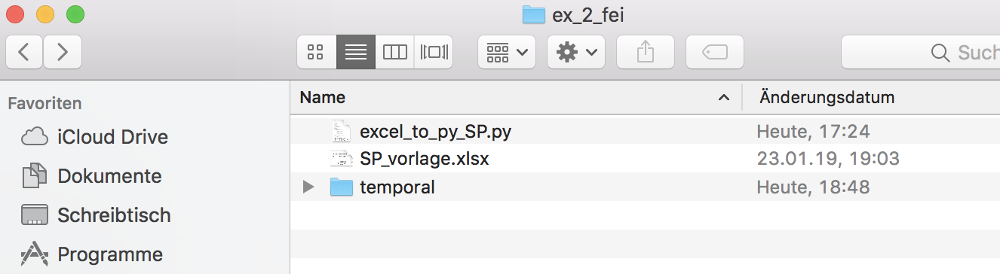
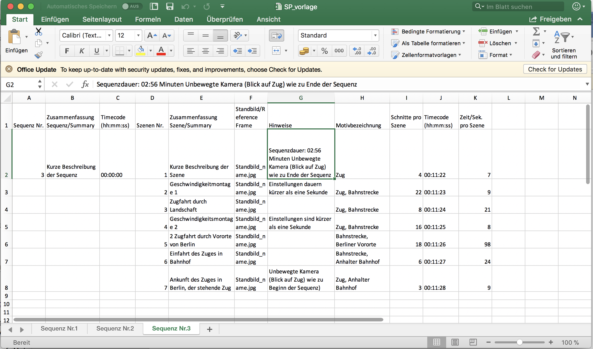
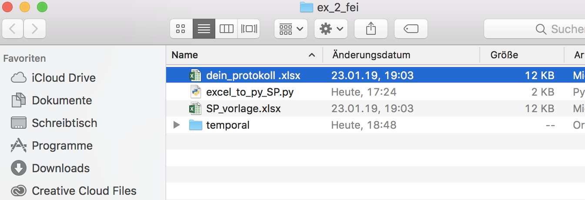
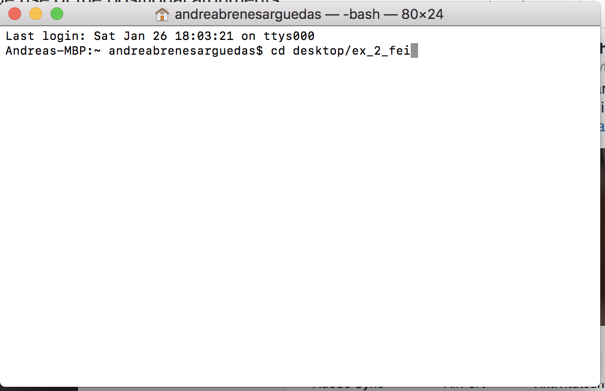
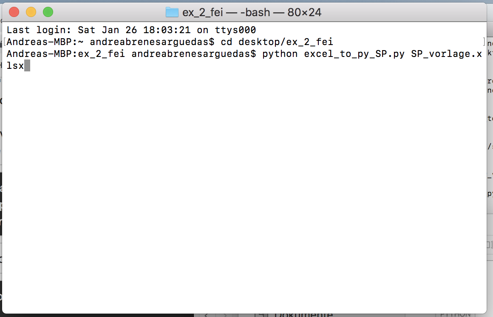
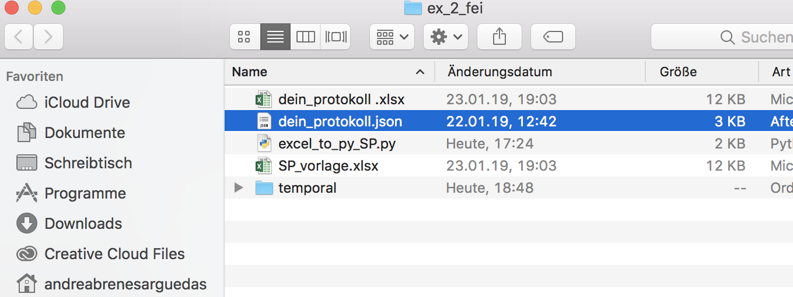

*Converting Excel Files to FEI format / Sequence Protocol*

Instructions:

1\. Download the [Ex2Fei Folder](https://github.com/cemfi/FEI/raw/master/apps/Ex2FEI/Ex2FEI.zip)

The Folder contains two files:

 SP\_Vorlage (Excel template for the Sequence Protocol) and a Excel\_to\_py\_SP.py (Python App)

2\. SP\_vorlage (Excel workbook)

Fill the excel template using the data from your sequence protocol (See Protokolle Erklärung.pdf)

Example:

Notes: Make a new Sheet for every sequence

Important: Be sure that every column containing “Timecode” is formated as text (Menu – Format – Cell format – Text)

3\. Save (save as) the document with the name of your choice.

4\. Open your Terminal window

You find your Terminal window here:

MacOS: applications/utilities/terminal

Using cd command type the path to your downloaded folder to change the directory. Press enter.

Type the following command line:
Python excel_to_py_SP.py your_excel_file_name.xlsx
Press enter.

Open the ex_2_fei Folder.
A file with your protocols name.json is now there. This is your FEI document.

