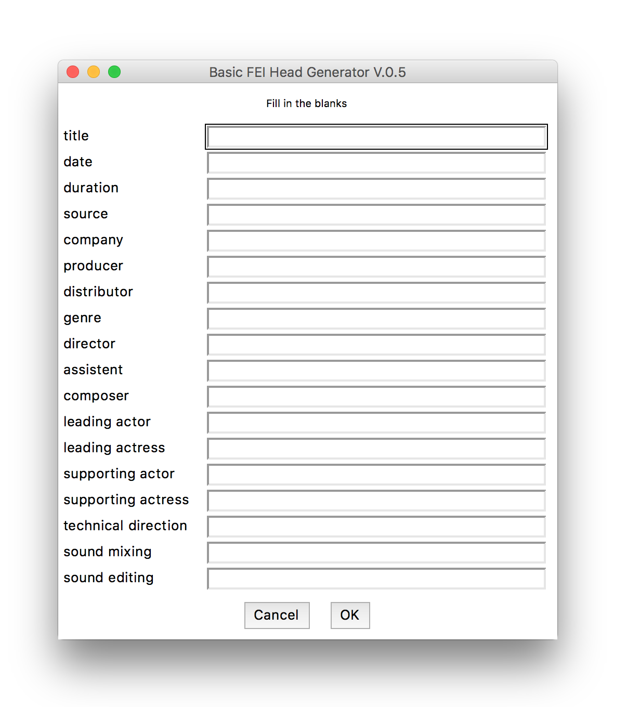
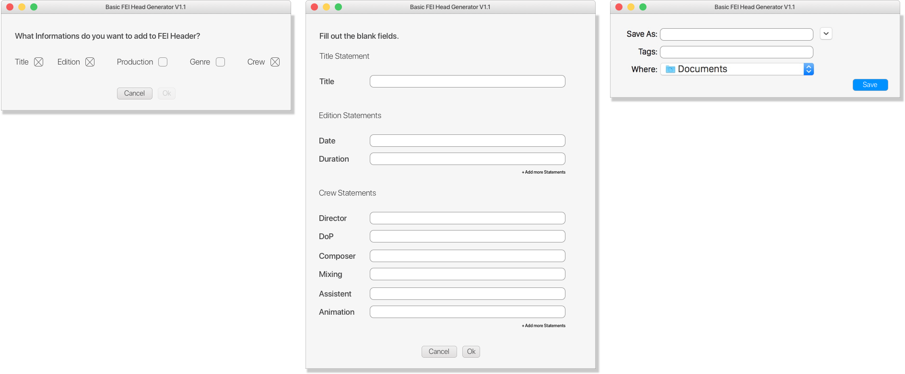

# FEI Header Generator Version 0.5

This tool provides a graphical interface for the creation of FEI headers.

## Installation

`pip install easygui`

## Usage

`python fei_header.py`

This creates a `myfei.json` file that contains all the provided header info.

## Future Improvements for Version 1.0

- Change locations for file to be saved
- Modular interface:
	- User can choose which fields to fill out
	- User can add items to his needs (more castmembers etc)
  - User can define his own fields for special cases
	- Programm checks for fields not filled-out and gives visual feedback
  
  
